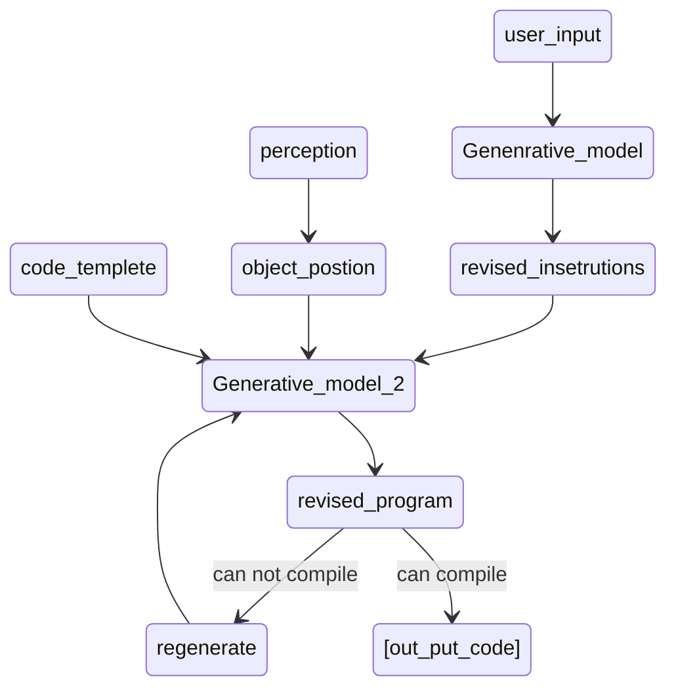

# VM_350
Vm350 final project
- set up: `pip install openai`
This is used for the environment set up for the API of chatgpt.
-  The Basic Control Flow:

```mermaid
stateDiagram-v2
   perception --> object_postion
   user_input --> Genenrative_model
   Genenrative_model --> revised_insetrutions
   revised_insetrutions --> Generative_model_2
   object_postion --> Generative_model_2
   code_templete --> Generative_model_2
   Generative_model_2 --> revised_program
   revised_program --> regenerate: can not compile
   revised_program --> [out_put_code]: can compile
   regenerate --> Generative_model_2 
```
